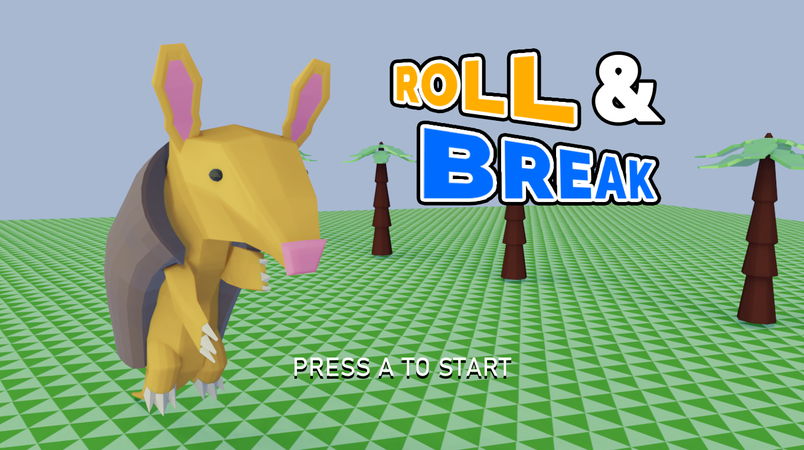

# Roll & Break
Roll and Break is an entry for the [37th gm(48) game jam](https://gm48.net/results/37/falling-apart)! The theme of the jam was "Falling Apart". This entry was created over the course of two days, from 1/16/2021 to 1/17/2021.

## Running Roll & Break
Roll & Break was created in [Game Maker Studio 2.3](https://www.yoyogames.com/). The subfolder `roll-and-break` contains the Game Maker project.

## License
Please feel free to use the _code_ under the permissive MIT License (i.e. you can use, modify, copy, distribute, etc) without needing to ask my permission or credit me (although credit is highly appreciated!)

I would ask that you do _not_ copy or distribute the art, music, or general concepts. Thank you!
